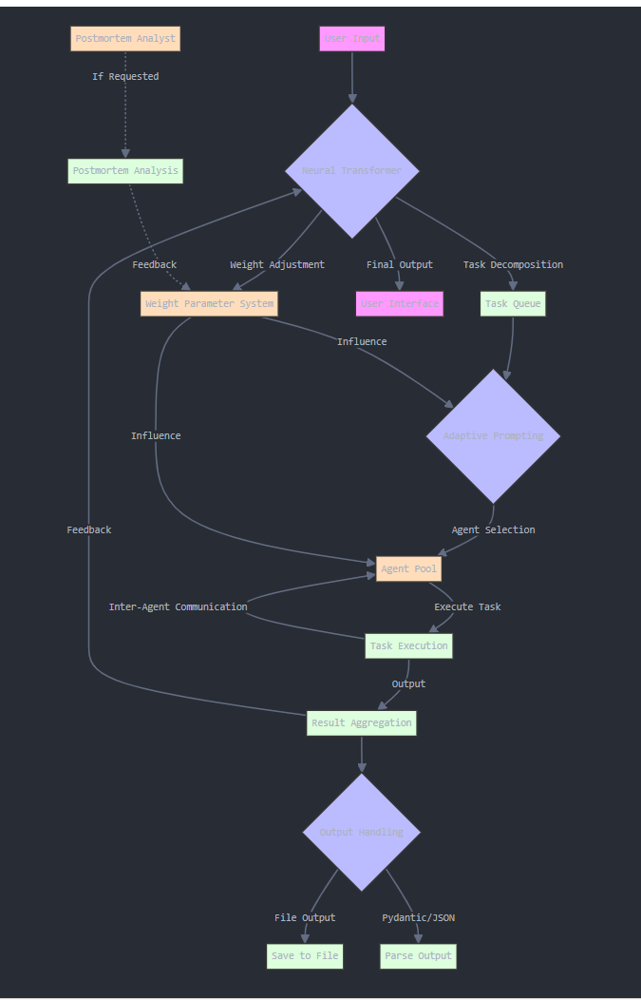

# SYZYGI

Syzygi is a self-improvement framework for orchestrating role-playing, autonomous AI agents. Built on top of CrewAI, Syzygi fosters collaborative intelligence, empowering agents to work together seamlessly and tackle complex tasks.

### [Homepage]
AI HIVE (https://www.ai-hive.net/syzygi)

### contact: 
info@ai-hive.net

### Introduction
As AI foundation models advance, they are approaching PhD-level reasoning and logic abilities. While AI doctors, lawyers, and engineers aren't ready to practice independently, every professional will want a specialized AI partner to assist them in delivering premium service to their clients.

### The Problem
AI agent teams partnering with professionals face poor coordination, limited adaptability, and inconsistent performance. Trust issues and integration hurdles hinder adoption. AI needs better collaboration mechanisms, adaptive learning, and robust feedback loops to improve.

### The Solution
Syzygi is an AI Agent Team Architecture that mimics features of the neural net Transformer Architecture used to train LLMs. It provides power and flexibility for AI agents to synchronize their tasks on one project and train as a team over many projects. The LLM acts as the brain to conduct reasoning and make decisions while the agents act as its 'arms and legs.' The agent 'arms and legs' are search engines. grammar editors, and other tools to carryout the tasks to reach the goal.

## Syzygi - AI Agent Team Architecture

Syzygi presents a novel architecture that synergizes the strengths of specialized AI agents with powerful mechanisms found in transformer models. It is centered around a large language model (LLM) acting as a neural transformer, enhancing collaborative problem-solving, adaptability, and scalability in AI systems.

# Diagram



# How Syzygi Extends CrewAI
 While LangChain provides a comprehensive toolkit for building LLM-powered applications, CrewAI specializes in creating collaborative multi-agent systems. CrewAI leverages LangChain's capabilities but adds a layer of abstraction specifically designed for orchestrating multiple AI agents working together on complex tasks. Syzygi builds upon CrewAI's foundation to create a more sophisticated and adaptable AI agent self-improvement system.

### Neural Transformer:
Implements a central LLM to coordinate and integrate agent outputs, inspired by transformer architectures.
Adaptive Prompting: Dynamically generates prompts for agents based on task context, enhancing flexibility and performance.
Task Decomposition: Introduces a module for breaking down complex problems into manageable subtasks, improving efficiency and parallelization.

### Transformer-Inspired Mechanisms: 
Adapts concepts like attention mechanisms for task-agent relevance scoring and dynamic agent prioritization.
Enhanced Feedback Loops: Implements multi-layered feedback systems including inter-agent, central LLM to agent, and user to system feedback for continuous improvement.

### Weight Parameter System: 
Dynamically adjusts the influence of different components, balancing stability and adaptability.
Scalability: Designed with production environments in mind, allowing for easier scaling and integration with existing systems.

### Flexible Process Management: 
While building on CrewAI's sequential and hierarchical processes, Syzygi aims to introduce more complex processes like consensual and autonomous in future iterations.

# Key Features

### Role-Based Agent Design: 
Customize agents with specific roles, goals, and tools.

### Autonomous Inter-Agent Delegation: 
Agents can autonomously delegate tasks and inquire amongst themselves.

### Flexible Task Management: 
Define tasks with customizable tools and assign them to agents dynamically.

### Processes Driven: 
Supports sequential task execution and hierarchical processes.

### Output Handling: 
Save outputs as files or parse them as Pydantic models or JSON.

### Open Source Model Compatibility: 
Works with both proprietary (e.g., OpenAI) and open-source models.

# Installation

## Getting Started
To get started follow these simple steps:

### 1. Installation
```
pip install crewai
```
```
pip install 'crewai[tools]'
```
### 2. Setting Up Your Crew
``` 
pip install -r requirements.txt
```
### add new file 
```
app.py
```
### add file 
```
streamlit_app.py
```
### Run
``` 
streamlit run streamlit_app.py
``` 
## Project Structure
### app.py: 
Core logic for running AI crews and postmortem analysis

### streamlit_app.py: 
Streamlit-based user interface

### requirements.txt: 
Project dependencies

### How Syzygi Extends CrewAI
Syzygi builds upon CrewAI's foundation to create a more sophisticated and adaptable AI agent collaboration system:

## Project Structure under development
### Neural Transformer: 
Implements a central LLM to coordinate and integrate agent outputs, inspired by transformer architectures.
Adaptive Prompting: Dynamically generates prompts for agents based on task context, enhancing flexibility and performance.

### Task Decomposition: 
Introduces a module for breaking down complex problems into manageable subtasks, improving efficiency and parallelization.

### Transformer-Inspired Mechanisms: 
Adapts concepts like attention mechanisms for task-agent relevance scoring and dynamic agent prioritization.

### Enhanced Feedback Loops: 
Implements multi-layered feedback systems including inter-agent, central LLM to agent, and user to system feedback for continuous improvement.

### Weight Parameter System: 
Dynamically adjusts the influence of different components, balancing stability and adaptability.
Scalability: Designed with production environments in mind, allowing for easier scaling and integration with existing systems.

### Flexible Process Management: 
While building on CrewAI's sequential and hierarchical processes, Syzygi aims to introduce more complex processes like consensual and autonomous in future iterations.

## License
This project is licensed under the MIT License. See the LICENSE file for details.

### SYZYGI AI Analysis Example Output
### Enter your request for analysis:

Analyze the latest advancements in AI in 2024. Identify key trends, breakthrough technologies, and potential industry impacts.

### Analysis complete!

### Analysis and Blog Post
The Transformative Power of AI in 2024: A Deep Dive into Emerging Trends and Technologies

Artificial Intelligence (AI) has continued to evolve at an astonishing pace, and 2024 is shaping up to be a landmark year for AI advancements. This article explores the key trends and technologies that are driving significant shifts in industry practices, efficiency, and innovation. From Generative AI to the metaverse, these developments are set to revolutionize various sectors, enhancing precision medicine, optimizing operational efficiency, and driving economic growth.

### Generative AI: Revolutionizing Creativity and Efficiency
Recent Advancements

Generative AI has seen remarkable improvements in model architectures, multimodal models, real-time generation, enhanced training techniques, and ethical considerations. For instance, the latest iterations of GPT, such as GPT-4 and GPT-5, have shown unprecedented capabilities in understanding context and generating human-like text. Models like DALL-E 3 and CLIP have pushed the boundaries of generating images from textual descriptions.

### Applications

Content Creation: From generating music and visual art in media to creating marketing content, Generative AI is enhancing creative processes.
Healthcare: AI-driven drug discovery and medical imaging are accelerating the development of new treatments and improving diagnostic accuracy.
Finance: Algorithmic trading and fraud detection systems are becoming more robust and efficient.
Manufacturing: Generative design algorithms are optimizing product designs and improving quality control.
Education: Personalized learning materials and interactive language learning tools are transforming education.
Potential Impact

Generative AI is poised to increase efficiency, create new job opportunities, enhance accessibility, and foster innovation across various sectors. However, it also raises ethical questions about authorship and the potential misuse of generated content.

Enhanced AI Ethics and Governance Frameworks: Building Trust and Accountability
Recent Advancements

In response to the rapid AI advancements, robust ethics and governance frameworks have been developed. Key regulatory developments include the European Union's AI Act and the U.S. National AI Initiative Act. Technological innovations like Explainable AI (XAI), fairness-aware machine learning, and privacy-preserving techniques are also making AI systems more transparent and fair.

### Key Principles

Transparency: Clear mechanisms for understanding AI decision-making processes.
Accountability: Established responsibilities and redress mechanisms.
Fairness and Non-Discrimination: Algorithms designed to prevent and mitigate biases.
Privacy and Data Protection: Strong protections for user data.
Human-Centricity: AI that augments human capabilities and respects autonomy.
Sector Implications

From healthcare and finance to education and public sector governance, these frameworks ensure that AI technologies are developed and deployed responsibly. They enhance trust, improve regulatory compliance, and ensure that AI serves the public interest.

AI-Driven Advancements in Healthcare: Transforming Patient Care
Recent Developments

AI-driven advancements in healthcare include predictive analytics, improved NLP for EHR management, enhanced medical imaging, robotic surgery, and accelerated drug discovery.

### Applications

Personalized Medicine: Tailored treatment plans based on genetic and lifestyle data.
Virtual Health Assistants: AI-powered assistants for medication reminders and symptom monitoring.
Telemedicine: Enhanced diagnostic tools and decision support systems.
Clinical Trials: Streamlined processes and improved success rates.
Administrative Automation: Reduced burdens on healthcare providers.
Potential Impact

AI in healthcare promises improved patient outcomes, cost reduction, increased accessibility, enhanced research and development, and the need for ethical and regulatory considerations.

Integration of AI with Automation: Driving Efficiency and Innovation
Recent Developments

Enhanced machine learning algorithms, edge AI, advancements in NLP, and intelligent process automation (IPA) are key developments in AI-driven automation.

### Applications

Manufacturing: Smart factories with predictive maintenance and optimized processes.
Healthcare: Automated diagnostics, treatment planning, and patient care.
Finance: Automated trading, fraud detection, and customer service.
Retail: Improved inventory management and personalized marketing.
Transportation and Logistics: Autonomous vehicles and drones for efficient deliveries.
Energy Sector: Optimized energy production and smart grids.
Potential Impact

AI-driven automation increases productivity, reduces costs, improves decision-making, enhances customer experience, fosters innovation, and transforms the workforce.

Improvements in Natural Language Processing (NLP): Enhancing Human-Machine Interaction
Recent Advancements

Transformers and pre-trained models like GPT-4, multimodal models, zero-shot and few-shot learning, ethical AI, and real-time translation systems have significantly improved NLP.

### Applications

Healthcare: Analyzing medical records and assisting in diagnostics.
Finance: Sentiment analysis, fraud detection, and customer service automation.
Legal: Document analysis and legal research.
Customer Service: Sophisticated virtual assistants and chatbots.
Education: Automated grading and personalized learning experiences.
Marketing and Sales: Analyzing customer feedback and optimizing content.
Potential Impact

NLP enhances efficiency, decision-making, accessibility, global communication, and personalization across various sectors.

### Conclusion
The advancements in AI in 2024 are set to bring transformative changes across multiple sectors. From Generative AI and enhanced ethics frameworks to AI-driven healthcare and automation, these technologies promise to enhance efficiency, foster innovation, and drive economic growth. As we continue to navigate this rapidly evolving landscape, it is essential to address ethical and regulatory challenges to fully realize the potential of AI.

### Visual Aids

To enhance the engagement and understanding of the content, the following visual aids are recommended:

Infographic depicting the advancements in Generative AI, including examples of text, image, and music generation.
Flowchart illustrating the AI ethics and governance framework introduced by the European Union.
Graph showing the accuracy improvement in medical imaging diagnostics with AI over the years.
Diagram of AI-powered automation in an Amazon warehouse, showcasing the workflow and efficiency gains.
Comparative table of NLP capabilities in 2023 vs. 2024, highlighting the improvements in translation and customer support.
This revised and finalized article incorporates the updated examples and data provided by the Senior Research Analyst and adheres to the structural and coherence feedback from the Research Evaluator and Writing Advisor. The inclusion of visual aids further enhances the engagement and clarity of the content.

### Analysis results saved to results/analysis_20240906_142041.txt

### Postmortem Analysis
Enter your request for postmortem analysis:

### Conduct a postmortem on the team's performance. How did we do and what could we improve for next time?

Postmortem analysis complete!

### Structured Postmortem Analysis
Postmortem Analysis of Team Performance

Project Overview: The task was to produce a comprehensive article titled "The Transformative Power of AI in 2024: A Deep Dive into Emerging Trends and Technologies." The article aimed to explore key trends and technologies driving significant shifts in industry practices, efficiency, and innovation, including Generative AI, AI ethics and governance, AI in healthcare, AI-driven automation, and NLP advancements.

### What Went Well

### Thorough Research and Analysis:

The team conducted extensive research, resulting in a well-rounded and informative article. The depth of knowledge displayed in areas such as Generative AI, AI ethics, AI in healthcare, AI-driven automation, and NLP was impressive.
The incorporation of the latest advancements and applications across various sectors showcased the team’s ability to stay updated with current trends and technologies.
### Clear Structure and Coherence:

The article was well-structured with clear sections, making it easy to follow. Each section covered a specific aspect of AI advancements and their implications, contributing to a cohesive narrative.
The use of headings and subheadings helped in organizing the content, enhancing readability.
Detailed Applications and Potential Impacts:

Each section provided detailed applications of AI technologies, demonstrating their real-world relevance and potential impacts. This added value to the article by linking theoretical advancements to practical uses.
The potential impacts were thoughtfully discussed, considering both the benefits and ethical concerns, which added depth to the analysis.
Inclusion of Visual Aids:

The recommendation to include visual aids such as infographics, flowcharts, graphs, and diagrams was a strong point. Visual aids can significantly enhance reader engagement and understanding of complex information.
Areas for Improvement

### Consistency in Depth Across Sections:

While the sections on Generative AI and AI in healthcare were detailed, other sections like AI-driven automation and NLP advancements could have benefited from more depth and specific examples.
Future tasks should ensure a balanced depth of information across all sections to maintain consistency.
Integration of Real-World Case Studies:

The article could have been enriched by integrating real-world case studies or examples of organizations successfully implementing these AI technologies. This would provide practical insights and make the content more relatable.
Including interviews or quotes from industry experts could also add credibility and varied perspectives to the article.
Enhanced Focus on Ethical and Regulatory Implications:

While ethical considerations were mentioned, a more detailed exploration of the regulatory landscape and its implications for AI development and deployment would add value.
Future articles should delve deeper into the challenges and solutions related to AI ethics and governance.
Specific Recommendations for Future Tasks

### Balanced Research and Depth:

Allocate research efforts evenly across all sections to ensure comprehensive coverage. Consider assigning specific team members to focus on underrepresented areas to achieve a balanced depth of information.
Incorporate Real-World Case Studies:

Integrate relevant case studies and examples from various industries to illustrate the practical applications and impacts of AI technologies. This can be achieved by conducting interviews with industry professionals or sourcing information from reputable case studies.
Focus on Ethical and Regulatory Aspects:

Dedicate a section or a more detailed discussion to ethical and regulatory aspects of AI. Explore current regulations, potential future changes, and their implications on AI development and deployment.
Visual Aids and Interactive Elements:

Continue to use visual aids to enhance engagement. Consider incorporating interactive elements such as clickable diagrams or embedded videos for a more dynamic reader experience.
Ensure that the visual aids are well-integrated into the content and directly relevant to the sections they accompany.
Regular Updates and Team Feedback:

Establish a process for regular updates and feedback within the team. This could involve periodic check-ins and collaborative review sessions to ensure alignment and address any challenges promptly.
Conclusion

The team’s performance in producing the article "The Transformative Power of AI in 2024" was commendable, with strong research, clear structure, and detailed applications. By addressing the identified areas for improvement and implementing the specific recommendations, future tasks can achieve even greater depth, relevance, and engagement. This postmortem analysis aims to guide the team in refining their approach and enhancing the quality of their work in future projects.

### AI Recommendations
Placeholder for AI-generated recommendations based on postmortem analysis